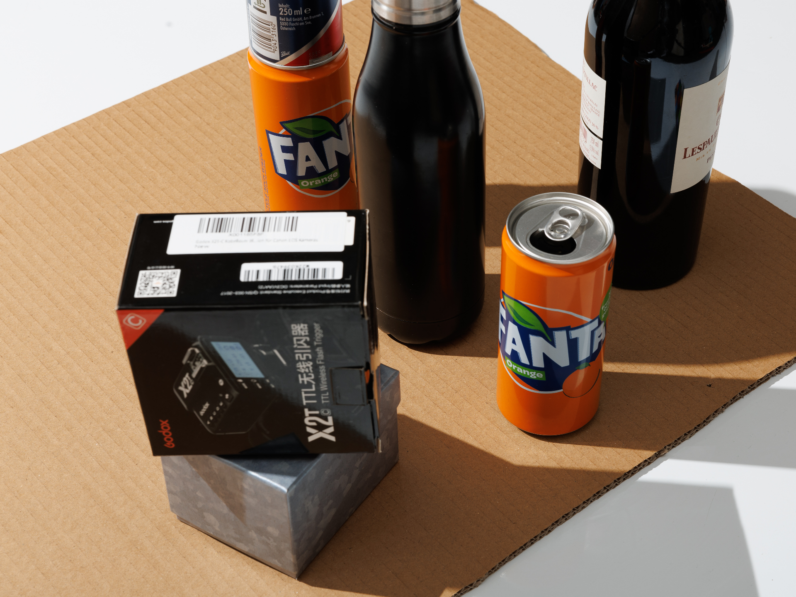
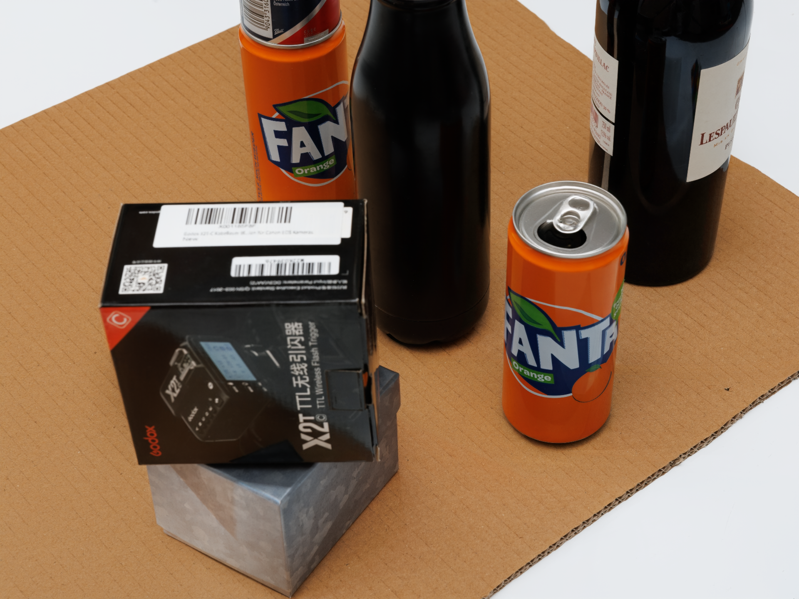

# NTIRE 2026: Shadow Removal Challenge (FusionNet Optimization)

This repository benchmarks state-of-the-art shadow removal architectures and explores **Exposure Fusion** strategies for the NTIRE 2026 challenge.

## 🔬 Experiment Summary
We conducted a comparative inference study on 4 architectures:
1. **ReHiT (Team Oath)** - [NTIRE 2025 Winner]
2. **DeshadowNet (SVNIT)**
3. **Seyeon's Implementation**
4. **Auto-Exposure Fusion (FusionNet)** - *Selected for optimization*

## 🚀 My Contribution (Current Work)
Based on the benchmarking results, I am currently optimizing the **Shadow-Aware FusionNet**.
- **Code:** See experiments/Fusion_Training_exp.ipynb
- **Optimization:** Replaced standard L1 loss with a hybrid **Charbonnier + VGG Perceptual Loss**.
- **Status:** Trained for **20 Epochs** on ISTD dataset, achieving competitive PSNR parity with baseline inference.

## 🖼️ Qualitative Results (Epoch 20)
| Input Image (With Shadow) | My Fusion Output (Shadow Removed) |
| :---: | :---: |
|  |  |

## 🛠️ Model Architecture
The pipeline consists of two stages:
1. **Shadow-Aware FusionNet:** Generates fusion parameters to blend multi-exposure inputs.
2. **Boundary-Aware RefineNet:** Refines the shadow edges (penumbra) using the optimized loss function.
